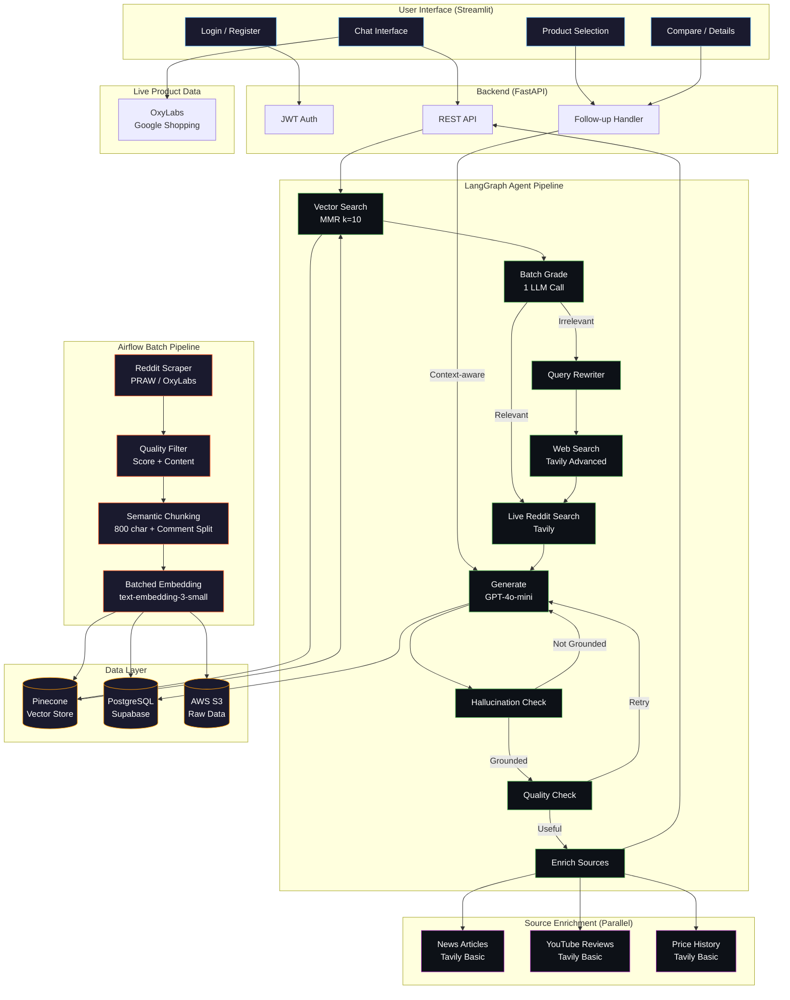
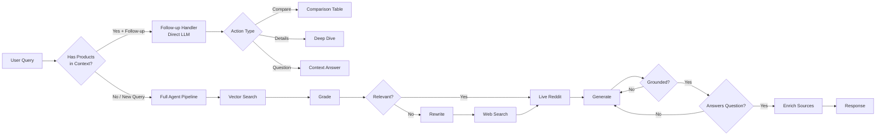
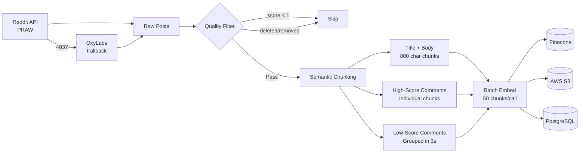

# Rekomme - System Architecture

## Full Architecture Diagram

```mermaid
graph TB
    subgraph USER["User Interface (Streamlit)"]
        LOGIN[Login / Register]
        CHAT[Chat Interface]
        SELECT[Product Selection]
        COMPARE[Compare / Details]
    end

    subgraph BACKEND["Backend (FastAPI)"]
        AUTH[JWT Auth]
        API[REST API]
        FOLLOWUP[Follow-up Handler]
    end

    subgraph AGENT["LangGraph Agent Pipeline"]
        direction TB
        VS[Vector Search<br/>MMR k=10]
        BG[Batch Grade<br/>1 LLM Call]
        QR[Query Rewriter]
        WS[Web Search<br/>Tavily Advanced]
        LRS[Live Reddit Search<br/>Tavily]
        GEN[Generate<br/>GPT-4o-mini]
        HC[Hallucination Check]
        QC[Quality Check]
        ENRICH[Enrich Sources]
    end

    subgraph ENRICHMENT["Source Enrichment (Parallel)"]
        NEWS[News Articles<br/>Tavily Basic]
        YT[YouTube Reviews<br/>Tavily Basic]
        PRICE[Price History<br/>Tavily Basic]
    end

    subgraph DATA["Data Layer"]
        PINE[(Pinecone<br/>Vector Store)]
        PG[(PostgreSQL<br/>Supabase)]
        S3[(AWS S3<br/>Raw Data)]
    end

    subgraph PIPELINE["Airflow Batch Pipeline"]
        SCRAPE[Reddit Scraper<br/>PRAW / OxyLabs]
        FILTER[Quality Filter<br/>Score + Content]
        CHUNK[Semantic Chunking<br/>800 char + Comment Split]
        EMBED[Batched Embedding<br/>text-embedding-3-small]
    end

    subgraph LISTINGS["Live Product Data"]
        OXY[OxyLabs<br/>Google Shopping]
    end

    %% User flows
    LOGIN --> AUTH
    CHAT --> API
    SELECT --> FOLLOWUP
    COMPARE --> FOLLOWUP

    %% API to Agent
    API --> VS
    FOLLOWUP -->|Context-aware| GEN

    %% Agent flow
    VS --> PINE
    PINE --> VS
    VS --> BG
    BG -->|Relevant| LRS
    BG -->|Irrelevant| QR
    QR --> WS
    WS --> LRS
    LRS --> GEN
    GEN --> HC
    HC -->|Grounded| QC
    HC -->|Not Grounded| GEN
    QC -->|Useful| ENRICH
    QC -->|Retry| GEN

    %% Enrichment
    ENRICH --> NEWS
    ENRICH --> YT
    ENRICH --> PRICE

    %% Data persistence
    GEN --> PG
    ENRICH --> API

    %% Listings
    CHAT --> OXY

    %% Batch pipeline
    SCRAPE --> FILTER
    FILTER --> CHUNK
    CHUNK --> EMBED
    EMBED --> PINE
    EMBED --> S3
    EMBED --> PG

    %% Styling
    classDef userNode fill:#1a1a2e,stroke:#64B5F6,color:#fff
    classDef agentNode fill:#0d1117,stroke:#4CAF50,color:#fff
    classDef dataNode fill:#1a1a2e,stroke:#FF9800,color:#fff
    classDef enrichNode fill:#0d1117,stroke:#9C27B0,color:#fff
    classDef pipeNode fill:#1a1a2e,stroke:#FF5722,color:#fff

    class LOGIN,CHAT,SELECT,COMPARE userNode
    class VS,BG,QR,WS,LRS,GEN,HC,QC,ENRICH agentNode
    class PINE,PG,S3 dataNode
    class NEWS,YT,PRICE enrichNode
    class SCRAPE,FILTER,CHUNK,EMBED pipeNode
```

## Agent Decision Flow

```mermaid
flowchart LR
    A[User Query] --> B{Has Products<br/>in Context?}
    B -->|Yes + Follow-up| C[Follow-up Handler<br/>Direct LLM]
    B -->|No / New Query| D[Full Agent Pipeline]

    C --> E{Action Type}
    E -->|Compare| F[Comparison Table]
    E -->|Details| G[Deep Dive]
    E -->|Question| H[Context Answer]

    D --> I[Vector Search] --> J[Grade] --> K{Relevant?}
    K -->|Yes| L[Live Reddit]
    K -->|No| M[Rewrite] --> N[Web Search] --> L
    L --> O[Generate] --> P{Grounded?}
    P -->|Yes| Q{Answers Question?}
    P -->|No| O
    Q -->|Yes| R[Enrich Sources]
    Q -->|No| O
    R --> S[Response]
```

## Data Pipeline Flow

```mermaid
flowchart LR
    A[Reddit API<br/>PRAW] -->|403?| B[OxyLabs<br/>Fallback]
    A --> C[Raw Posts]
    B --> C

    C --> D{Quality Filter}
    D -->|score < 1| E[Skip]
    D -->|deleted/removed| E
    D -->|Pass| F[Semantic Chunking]

    F --> G[Title + Body<br/>800 char chunks]
    F --> H[High-Score Comments<br/>Individual chunks]
    F --> I[Low-Score Comments<br/>Grouped in 3s]

    G --> J[Batch Embed<br/>50 chunks/call]
    H --> J
    I --> J

    J --> K[(Pinecone)]
    J --> L[(AWS S3)]
    J --> M[(PostgreSQL)]
```
